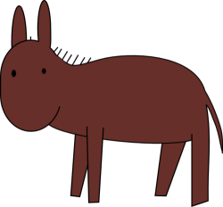

# Bartram: Adventure Time Color Analysis Tool

Bartram is a collection of scripts to analyze the colors in *Adventure Time* title cards and episodes, named after this cutie:

## Dependencies

* [2f30's `colors` (plus provided patch for video analysis)](http://git.2f30.org/colors/)
* [GNU parallel](https://gnu.org/software/parallel/)
* [ffmpeg](https://ffmpeg.org/)
* [GraphicsMagick](http://graphicsmagick.org/)

## Setup

Patch and build `colors`. Place the binary in Bartram's directory.

	git clone git://git.2f30.org/colors.git colors-git
	cd colors-git
	git apply ../colors.patch
	make
	mv colors ..

## Titlecard Color Analysis

> Note: `./scripts/titlecards.sh` automates this process.

1. Make sure you have all Bartram's dependencies: `./scripts/check_dependencies.sh`.
2. Download titlecards, extract, and rename them for processing: `./scripts/download_titlecards.sh`. This may take a while, depending on your connection speed.
3. Convert titlecards to PNG (for `colors`) and extract colors: `./scripts/extract_titlecard_colors.sh`.
4. Generate titlecard color preview images: `./scripts/generate_titlecard_previews.sh`.

## Video Analysis

> Note: `./scripts/videos.sh` automates this process.

> Any video format supported by `ffmpeg` should work.

1. Place the videos you want to analyze into `./videos`. Name them the same as their corresponding titlecard, for instance `001 - S01E01 - Slumber Party Panic.mp4`.
2. Extract frames from your videos: `./scripts/extract_video_frames.sh`. This will take a while.
3. Generate colors from the extracted frames: `./scripts/extract_video_frame_colors.sh`.
4. Generate video color preview images: `./scripts/generate_video_previews.sh`. This requires that you applied the `colors` patch as described in the "Setup" section of this file.

---

Preview images are created in `titlecard_previews` and `video_previews`. Other intermediate directories and files are also created during the analysis.

The files generated by Bartram during analysis may take up a lot of disk space, particularly the extracted video frames. You may wish to delete these files after you are done. You may also wish to do your analysis in batches, particularly for video analysis.

## License

  
Bartram is licensed under [CC0](https://creativecommons.org/publicdomain/zero/1.0/).

Additionally, I do not claim ownership over any *Adventure Time* property or characters.